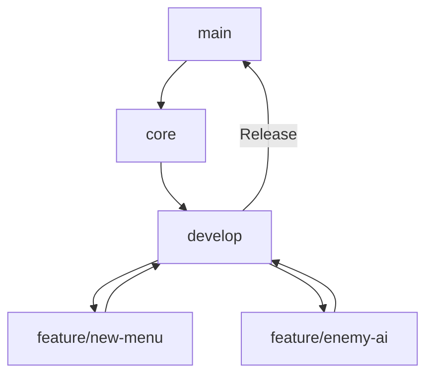

# BetForge

*Versão 2.0 | Última atualização: [DATA]*

---

## Índice
1. [Visão Geral](#visão-geral)
2. [Estrutura de Branches](#estrutura-de-branches)
3. [Organização de Pastas](#organização-de-pastas)
4. [Fluxo de Trabalho](#fluxo-de-trabalho)
5. [Proteção do Código Core](#proteção-do-código-core)
6. [Resolução de Conflitos](#resolução-de-conflitos)

---

## Visão Geral <a name="visão-geral"></a>
Este documento define a estruturação de um projeto Unity usando Git para:
- Evitar sobrescritas de cenas/sprites.
- Isolar o código central (`core`).
- Facilitar colaboração em múltiplas branches.

---

## Estrutura de Branches <a name="estrutura-de-branches"></a>

### Principais Branches
| Nome          | Função                                                                 |
|---------------|------------------------------------------------------------------------|
| **`master`**    | Versão estável (implantável para o público).                          |
| **`core`**    | Sistemas centrais (save, input, UI base).                             |
| **`develop`** | Branch de integração para features.                                   |
| **`feature/*`** | Branches temporárias para funcionalidades específicas (ex: `feature/new-menu`). |

### Diagrama de Fluxo

## Organização de Pastas <a name="organização-de-pastas"></a>
```mermaid
Assets/
├─ Core/                  # Sistemas compartilhados
│  ├─ Scripts/            # Código central (ex: SaveSystem.cs)
│  ├─ Prefabs/            # Prefabs base (ex: Player.prefab)
├─ Features/              # Funcionalidades isoladas
│  ├─ NewMenu/            # Implementação completa de um menu
│  │  ├─ Scenes/          # Cenas específicas (Menu.unity)
│  │  ├─ Sprites/         # Assets visuais
├─ Scenes/
│  ├─ Main.unity          # Cena inicial (gerencia carregamento)
ProjectSettings/          # Configurações do projeto (só altere na branch `core`)
```
## Fluxo de Trabalho <a name="fluxo-de-trabalho"></a>
### Desenvolvendo uma Feature<br>
1. Crie a branch a partir da develop:
    ```bash
    git checkout develop
    git merge core  # Atualize com o core mais recente
    git checkout -b feature/nova-feature
    ```
2. Desenvolva apenas na pasta `Assets/Features/nova-feature/`.
3. Mescle na develop após revisão:
    ```bash
    git checkout develop
    git merge feature/nova-feature --no-ff
    ```
### Atualizando o Core
1. Faça alterações apenas na branch `core`:
    ```bash
    git checkout core
    # Modifique Assets/Core/ ou ProjectSettings/
    git commit -m "Atualiza sistema de input"
    ```
2. Mescle as mudanças na `develop`:
    ```bash
    git checkout develop
    git merge core --no-ff
    ```
## Proteção do Código Core <a name="proteção-do-código-core"></a>
### Git Hook Local
Adicione um script para bloquear alterações não autorizadas no `core`:
1. Crie `.git/hooks/pre-commit`:
    ```bash
    #!/bin/sh
    ALLOWED_BRANCHES="core main develop"
    CORE_PATHS="Assets/Core ProjectSettings"
    
    CURRENT_BRANCH=$(git branch --show-current)
    CHANGED_FILES=$(git diff --cached --name-only -- $CORE_PATHS)
    
    if [[ ! $ALLOWED_BRANCHES =~ $CURRENT_BRANCH && -n $CHANGED_FILES ]]; then
      echo "ERRO: Não modifique o core fora das branches permitidas!"
      exit 1
    fi
    ```
2. Dê permissão:
    ```bash
    chmod +x .git/hooks/pre-commit
    ```
### CI/CD (GitHub Actions)
Exemplo de verificação em PRs:
```yaml
    name: Core Protection
    on: [pull_request]
    
    jobs:
      check-core:
        runs-on: ubuntu-latest
        steps:
          - uses: actions/checkout@v4
          - name: Verificar alterações no core
            run: |
              if [[ "${{ github.base_ref }}" != "core" ]]; then
                CORE_FILES=$(git diff --name-only ${{ github.base_ref }}...HEAD -- Assets/Core ProjectSettings)
                if [[ -n "$CORE_FILES" ]]; then
                  echo "::error::Altere o core apenas na branch 'core'!"
                  exit 1
                fi
              fi
```
## Resolução de Conflitos <a name="resolução-de-conflitos"></a>
## Configuração do UnityYAMLMerge
1. No Unity:
    - `Edit → Project Settings → Editor`
    - **Asset Serialization Mode**: `Force Text`
2. Adicione ao `.gitattributes`:
    ```
    *.unity merge=unityyamlmerge
    *.prefab merge=unityyamlmerge
    *.asset merge=unityyamlmerge
    ```
3. Configure o Git:
    ```bash
    git config --global merge.unityyamlmerge.driver "<PATH_DO_UNITY>/UnityYAMLMerge merge -p %O %B %A %A"
    ```
