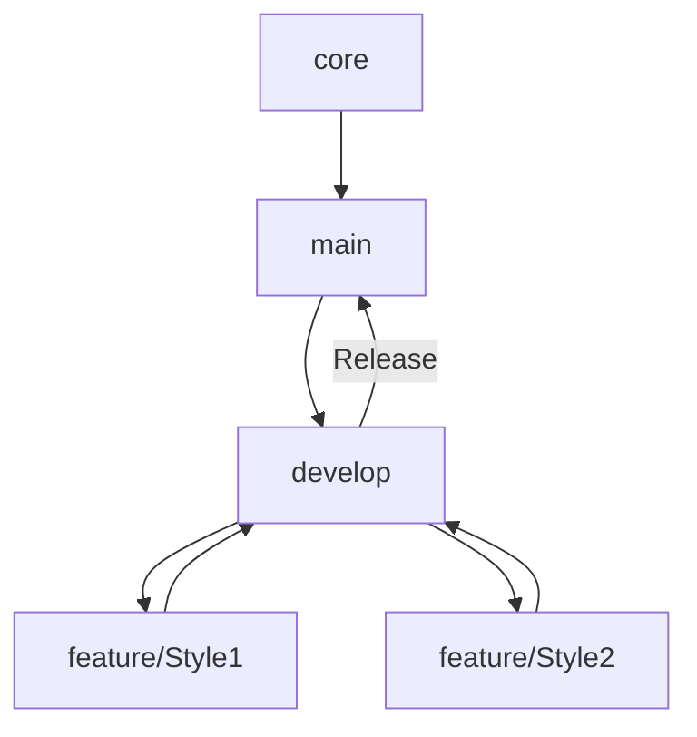

# BetForge

*Versão 2.0 | Última atualização: [DATA]*

---

## Índice
1. [Visão Geral](#visão-geral)
2. [Estrutura de Branches](#estrutura-de-branches)
3. [Organização de Pastas](#organização-de-pastas)

---

## Visão Geral <a name="visão-geral"></a>
Este documento define a estruturação de um projeto Unity usando Git para:
- Evitar sobrescritas de cenas/sprites.
- Isolar o código central (`core`).
- Facilitar colaboração em múltiplas branches.

---

## Estrutura de Branches <a name="estrutura-de-branches"></a>

### Principais Branches
| Nome          | Função                                                                 |
|---------------|------------------------------------------------------------------------|
| **`master`**    | Versão estável (implantável para o público).                          |
| **`core`**    | Sistemas centrais (save, input, UI base).                             |
| **`develop`** | Branch de integração para features.                                   |
| **`feature/*`** | Branches temporárias para funcionalidades específicas (ex: `feature/new-menu`). |

### Diagrama de Fluxo

## Organização de Pastas <a name="organização-de-pastas"></a>
```
Assets/
├─ Core/                  # Sistemas compartilhados
│  ├─ Scripts/            # Código central (ex: SaveSystem.cs)
│  ├─ Prefabs/            # Prefabs base (ex: Player.prefab)
├─ Features/              # Funcionalidades isoladas
│  ├─ NewMenu/            # Implementação completa de um menu
│  │  ├─ Scenes/          # Cenas específicas (Menu.unity)
│  │  ├─ Sprites/         # Assets visuais
├─ Scenes/
│  ├─ Main.unity          # Cena inicial (gerencia carregamento)
ProjectSettings/          # Configurações do projeto (só altere na branch `core`)
```
